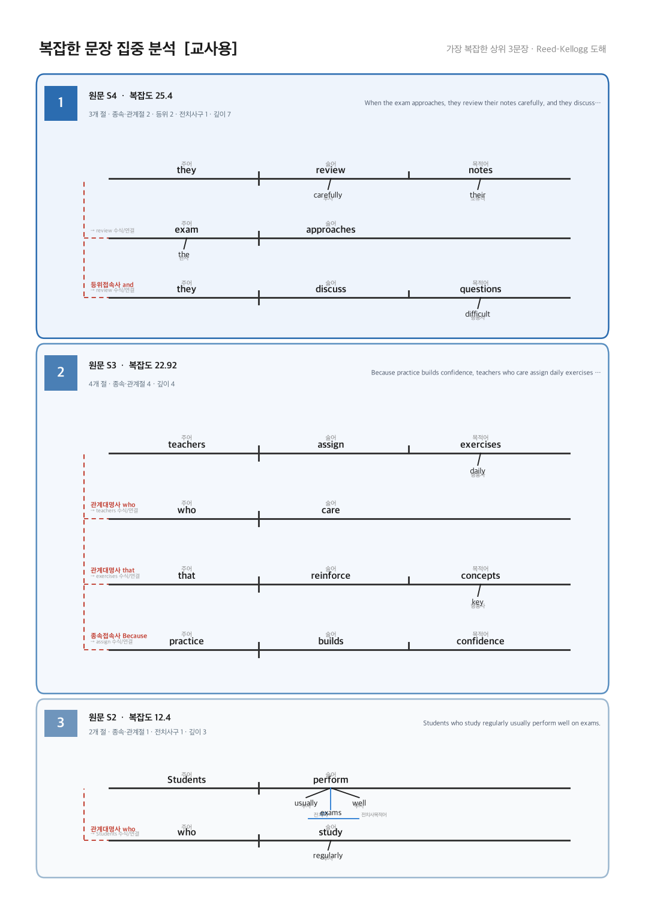
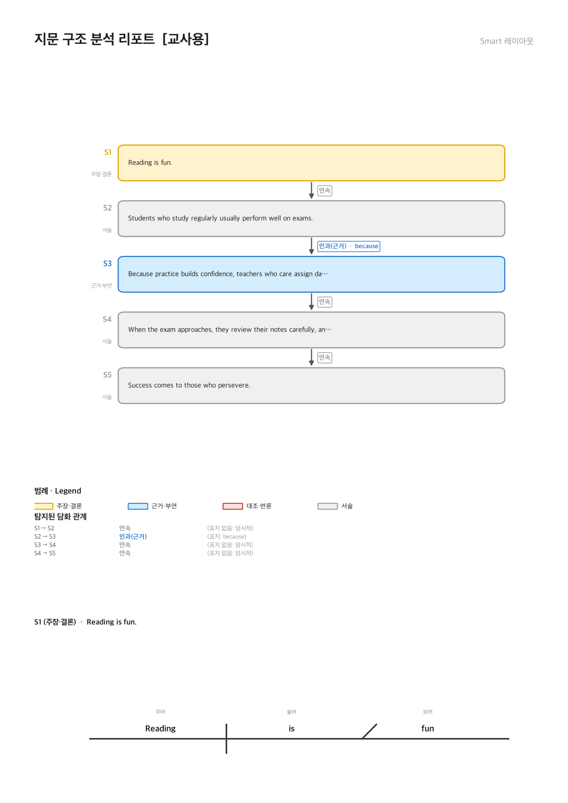
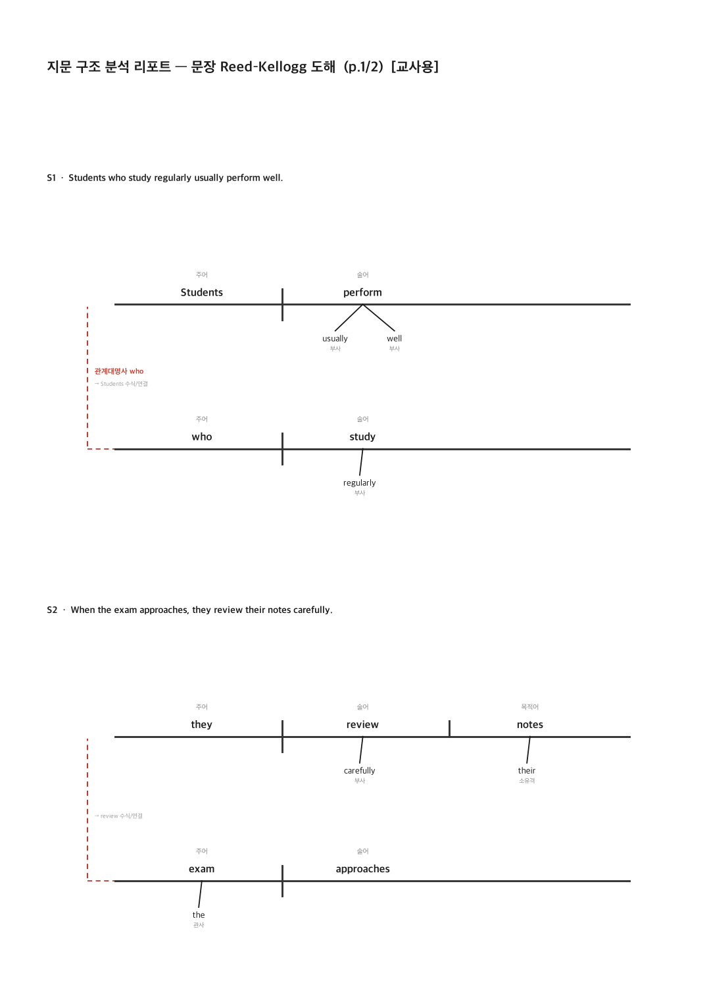
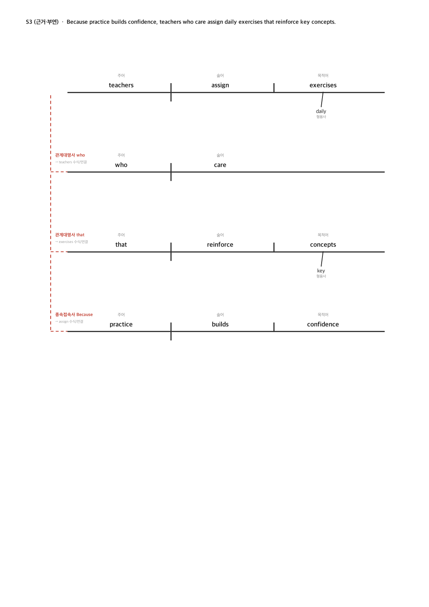

# 영어 지문 구조 다이어그래머 (Sentence & Discourse Diagramming)

영어 지문(수능 모의고사·학습 지문 등)을 넣으면 **문장 단위 다이어그램**과 **글 흐름(담화 구조) 다이어그램**을 함께 생성하는 Streamlit 앱입니다. spaCy 의존구조 파싱으로 각 문장을 분석하고, 담화표지 규칙(옵션: Claude LLM)으로 글의 논리 흐름을 구조화합니다.

## 주요 기능

- **문장 다이어그램 2종**
  - **Reed–Kellogg 도해**(기본) — 한국 영문법식 성분 표기: 주어·술어·목적어·보어·수식어·관계대명사·접속사. 명료한 고정 규칙으로 절마다 baseline을 분리해 깨지지 않음.
  - **의존구조(dependency)** — spaCy 의존 관계를 한국어 라벨로.
- **글 흐름 다이어그램** — 담화표지(because/however/therefore …)로 문장 간 관계(연속·인과·대조·예시)를 탐지하고, 역할(주장·근거·대조·서술)을 색으로 구분. RST 담화 나무 표기도 지원.
- **A4 인쇄용 벡터 PDF** — 교사용(정답)·학생용(빈칸 워크시트) 템플릿.
- **레이아웃 4종**
  - `전체` 다중 페이지 · `압축` 1페이지 요약
  - `벤또` — 가장 **복잡한 3문장**을 복잡도 점수로 뽑아 카드 그리드로 집중 배치
  - `스마트` — 각 다이어그램을 **블록 객체**로 처리해 페이지 경계에서 **잘리지 않도록** 페이지네이션. 포함할 문장 선택·문장별 페이지 나눔 등 편집(Smart Editor) 지원.

## 화면 예시

| 벤또 그리드 (복잡한 3문장) | 스마트 레이아웃 (글 흐름) |
|---|---|
|  |  |

| 관계절 RK 도해 | 스마트 RK 문장 페이지 |
|---|---|
|  |  |

## 로컬 실행

```bash
python -m venv .venv && source .venv/bin/activate
pip install -r requirements.txt
streamlit run app.py
```

`requirements.txt`가 spaCy 영어 모델(en_core_web_sm 3.8.0)을 whl로 직접 설치합니다. Claude LLM 심화 분석은 선택 사항이며, 앱 사이드바에 API 키를 넣으면 활성화됩니다(키 없이도 담화표지 규칙으로 동작).

## 배포

- **Streamlit Community Cloud / Hugging Face Spaces** (권장 시작점, 무료)
  - `requirements.txt` — 파이썬 의존성 + spaCy 모델
  - `packages.txt` — 시스템 패키지(`fonts-nanum`)로 한글 폰트 설치 → Linux에서 한글 깨짐 방지
  - `.streamlit/config.toml` — 테마
  - Claude API 키는 앱 **Secrets**에 `ANTHROPIC_API_KEY`로 저장
- 확장 시나리오(학원/학교용 계정·이력, SaaS)는 `DEPLOYMENT.md` 참조.

## 모듈 구성

| 파일 | 역할 |
|---|---|
| `app.py` | Streamlit UI (입력·탭·PDF 다운로드·Smart Editor) |
| `analyzer.py` | spaCy 문장 분석 + 담화표지/LLM 흐름 분석 |
| `reedkellogg.py` | Reed–Kellogg 도해 렌더러(결정론적 규칙) |
| `diagram.py` | 의존구조 SVG 렌더러(화면 표시용) |
| `a4report.py` | A4 PDF 조립(템플릿·흐름표기·레이아웃·문장표기) |
| `complexity.py` | 문장 복잡도 채점·상위 N 추출 |
| `bento.py` | 벤또 카드 그리드 렌더러 |
| `smartlayout.py` | 블록 객체 페이지네이션(안 잘림) 엔진 |
| `DEPLOYMENT.md` | 배포 가이드(폰트·모델 pin·캐시·확장 시나리오) |

## 라이선스

MIT
